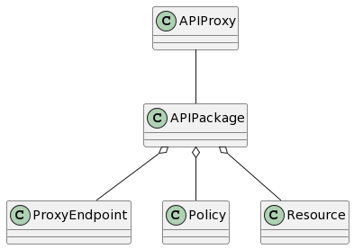

# Apigee SDK
This project provides a Java SDK for Apigee 

## Requirements

* java 11 or higher

## Content
This SDK contains all the necessary classes and logic to create an object representation of an Apigee Proxy bundle called APIPackage.
Inside an APIPackage we can define proxies endpoints, targets endpoints, policies and resources.

In the following sections, we walk through the different parts of this SDK to learn how to efficiently use it. 

## Installation of project
The project is hosted on Maven repository.
You can install it with all the build tools compatibles with Maven.

Example with Maven and Gradle :

### Maven

```xml
    <dependency>
        <groupId>fr.groupbees</groupId>
        <artifactId>apigee-sdk</artifactId>
        <version>1.0.0</version>
    </dependency>
```

### Gradle

```
    implementation group: 'fr.groupbees', name: 'apigee-sdk', version: '1.0.0'
```

## APIPackage structure

The following diagram highlights the structure of an **APIPackage** :



An **APIPackage** is associated to one and only one **APIProxy** and it is composed of one-to-many **ProxyEndpoint**, one-to-many **Policy** and one-to-many **Resource**

```java
Data
@NoArgsConstructor
public class APIPackage implements CommonPackage {

    private APIProxy apiProxy = new APIProxy();
    private LinkedHashSet<ProxyEndpoint> proxyEndpoints = new LinkedHashSet<>();
    private LinkedHashSet<TargetEndpoint> targetEndpoints = new LinkedHashSet<>();
    private LinkedHashSet<Policy> policies = new LinkedHashSet<>();
    private LinkedHashSet<Resource> resources = new LinkedHashSet<>();

    // methods skipped  
}
```

The goal of this SDK is to allow developers to instantiate an **APIPackage** programmatically.

On the following sections, we explore how to create the components of an **APIPackage**

## Flows
Flows are the basic building blocks of API proxies. They enable you to program the behavior of an API by letting you configure the sequence in which policies and code are executed by an API proxy. 
Flows are sequential stages along the API request processing path.

## Reminder : Flow execution sequence

The following diagram shows how flows are ordered sequentially within a proxy endpoint and target endpoint:


### Commons concerns

#### Flow steps

On each flow (PreFlow, Conditional Flow, PostFlow), both on the **ProxyEndpoint** and on the **TargetEndpoint** we can define step(s) populating with policy name and optionally some conditions 

Examples extracted from the ProxyEndpoint xml file :
```xml
    <PreFlow name="PreFlow">
        <Request>
            <Step>
                <Name>SA-GlobalRate</Name>
            </Step>
        </Request>
    <!-- ... --> 
    </PreFlow>
    <PostClientFlow>
        <Response>
            <Step>
                <Name>ML-INFO</Name>
            </Step>
        </Response>
    </PostClientFlow>
```

We can do exactly the same logic with the Java SDK.
Hereafter a Java example of defining steps on a TargetEndpoint

```java
        ProxyEndpoint proxy = new ProxyEndpoint();
        proxy.setName("proxy");
        proxy.setDescription("proxy description");
        proxy.setPostClientFlow(
                new PostClientFlow(
                        "post-client-flow",
                        "post-client-flow-desc",
                        new Steps(
                                new LinkedHashSet<>(
                                        Arrays.asList(
                                                new Step("postcf-res-step1-name", "postcf-res-step1-cond"),
                                                new Step("postcf-res-step2-name")
                                        )
                                )
                        )
                )
        );
```

#### Error handling

While API proxies are servicing requests from apps, error conditions might arise. For instance apps might present expired credentials, request messages might be incorrectly formatted, and so on.

Within this SDK we can define FaultRules or DefaultFaultRules on the Target and on the Proxy endpoints

The following example highlights the creation of a FaultRule

```java
        FaultRule faultRule = new FaultRule(
                "faultrule",
                "condition",
                new LinkedHashSet<>(Arrays.asList(
                        new Step("step1-name", "step1-condition"),
                        new Step("step2-name", "step2-condition")
                ))
        );
```

This snippet code will be serialized to the following xml code

```xml
<FaultRule name="faultrule">
    <Condition>condition</Condition>
    <Step>
        <Name>step1-name</Name>
        <Condition>step1-condition</Condition>
    </Step>
    <Step>
        <Name>step2-name</Name>
        <Condition>step2-condition</Condition>
    </Step>
</FaultRule>
```
### Proxy Endpoint
Contains the API proxy flows closest to the client. 
The ProxyEndpoint provides places for logic to act first on the request from the client, then last on the response to the client.

This SDK provides the API to build a **ProxyEndpoint**. 

The following code snippet gives an example and an overview of how to build a **ProxyEndpoint** :

```java
        ProxyEndpoint proxy = new ProxyEndpoint();
        proxy.setName("proxy");
        proxy.setDescription("proxy description");
        proxy.setDefaultFaultRule(new DefaultFaultRule());
        proxy.setFaultRules(new LinkedHashSet<>());
        proxy.setPreFlow(new Flow("pre-flow"));
        proxy.setPostFlow(new Flow("post-flow"));
        proxy.setPostClientFlow(
                new PostClientFlow(
                        "post-client-flow",
                        "post-client-flow-desc",
                        new Steps(
                                new LinkedHashSet<>(
                                        Arrays.asList(
                                                new Step("postcf-res-step1-name", "postcf-res-step1-cond"),
                                                new Step("postcf-res-step2-name")
                                        )
                                )
                        )
                )
        );
        proxy.setFlows(new LinkedHashSet<>());
        proxy.setHttpProxyConnection(
                new HTTPProxyConnection(
                        "/base-path",
                        Arrays.asList("default", "secure"),
                        Arrays.asList(
                                new NameValue("prop1-name", "prop1-val"),
                                new NameValue("prop2-name", "prop2-val")
                        )
                )
        );
        LinkedHashSet<RouteRule> routeRules = new LinkedHashSet<>(
                Arrays.asList(
                        new RouteRule(
                                "rr1-name",
                                "rr1-cond",
                                "rr1-target",
                                null
                        ),
                        new RouteRule(
                                "rr2-name",
                                "rr2-cond",
                                null,
                                "rr2-url"
                        ),
                        new RouteRule("rr3-name", null, null, null)
                )
        );
```

This snippet code will be serialized to the following xml code snippet : 

```xml
<?xml version="1.0" encoding="UTF-8"?>
<ProxyEndpoint name="proxy">
    <Description>proxy description</Description>
    <PreFlow name="pre-flow">
        <Request/>
        <Response/>
    </PreFlow>
    <PostFlow name="post-flow">
        <Request/>
        <Response/>
    </PostFlow>
    <DefaultFaultRule name="default-faultrule"/>
    <PostClientFlow name="post-client-flow">
        <Description>post-client-flow-desc</Description>
        <Response>
            <Step>
                <Name>postcf-res-step1-name</Name>
                <Condition>postcf-res-step1-cond</Condition>
            </Step>
            <Step>
                <Name>postcf-res-step2-name</Name>
            </Step>
        </Response>
    </PostClientFlow>
    <HTTPProxyConnection>
        <BasePath>/base-path</BasePath>
        <Properties>
            <Property name="prop1-name">prop1-val</Property>
            <Property name="prop2-name">prop2-val</Property>
        </Properties>
        <VirtualHost>default</VirtualHost>
        <VirtualHost>secure</VirtualHost>
    </HTTPProxyConnection>
    <RouteRule name="rr1-name">
        <Condition>rr1-cond</Condition>
        <TargetEndpoint>rr1-target</TargetEndpoint>
    </RouteRule>
    <RouteRule name="rr2-name">
        <Condition>rr2-cond</Condition>
        <URL>rr2-url</URL>
    </RouteRule>
    <RouteRule name="rr3-name"/>
</ProxyEndpoint>
```


### Target Endpoint
Contains the API proxy flows closest to the backend resource. 

The TargetEndpoint provides places for logic to prepare a request for, then handle the response from, a backend resource.

The following code snippet gives an example and an overview of how to build a **TargetEndpoint** :

```java
        TargetEndpoint target = new TargetEndpoint();
        target.setName("target");
        target.setDescription("description");
        target.setDefaultFaultRule(new DefaultFaultRule());
        LinkedHashSet<FaultRule> faultRules = new LinkedHashSet<>();
        target.setFaultRules(faultRules);
        target.setPreFlow(new Flow("pre-flow"));
        target.setPostFlow(new Flow("post-flow"));
        target.setFlows(new LinkedHashSet<>());
        target.setHttpTargetConnection(new HTTPTargetConnection());
        target.setLocalTargetConnection(new LocalTargetConnection());
```

This snippet code will be serialized to the following xml code snippet :

```xml
<?xml version="1.0" encoding="UTF-8"?>
<TargetEndpoint name="target">
    <Description>description</Description>
    <PreFlow name="pre-flow">
        <Request/>
        <Response/>
    </PreFlow>
    <PostFlow name="post-flow">
        <Request/>
        <Response/>
    </PostFlow>
    <DefaultFaultRule name="default-faultrule"/>
    <LocalTargetConnection/>
    <HTTPTargetConnection/>
</TargetEndpoint>
```
## Policies
  
### traffic management
The traffic management policies let you configure caching, control quotas, mitigate the effects of spikes, set concurrent rate limits, and perform other functions related to your API traffic.

Below some Java examples to demonstrate the usage of traffic management policies :

Spike Arrest policy :

```java
        SpikeArrestPolicy policy = new SpikeArrestPolicy();
        policy.setIdentifier(new Ref("ref"));
        policy.setMessageWeight(new Ref("ref"));
        policy.setRate(new ValueRef("value", "ref"));
        policy.setUseEffectiveCount(true);
```

Quota Policy :

```java
        QuotaPolicy policy = new QuotaPolicy();
        policy.setType(QuotaType.rollingwindow);
        policy.setInterval(new ValueRef<>(10, "ref"));
        policy.setStartTime("2021-5-27 10:00:00");
        policy.setDistributed(true);
        policy.setSynchronous(true);
        policy.setSynchronous(true);
        policy.setAsynchronousConfiguration(new AsynchronousConfiguration(10, 20));
        policy.setIdentifier(new Ref("ref"));
        policy.setMessageWeight(new Ref("ref"));
        policy.setTimeUnit(new ValueRef<>(QuotaTimeUnit.week, "unit-ref"));
```

Lookup Cache Policy :

```java
        LookupCachePolicy policy = new LookupCachePolicy();
        policy.setCacheResource("cache");
        policy.setScope(CacheScope.Proxy);
        policy.setAssignTo("assign");
        policy.setCacheLookupTimeoutInSeconds(10);

        CacheKey cacheKey = new CacheKey();
        cacheKey.setPrefix("prefix");

        CacheKeyValueRef<String> keyFragment1 = new CacheKeyValueRef<>("val1", "ref1", "type1");
        CacheKeyValueRef<String> keyFragment2 = new CacheKeyValueRef<>("val2", "ref2", "type2");
        cacheKey.setKeyFragments(Arrays.asList(keyFragment1, keyFragment2));

        CacheContext cacheContext = new CacheContext();
        cacheContext.setApiProxyName(new ValueRef<>("apiproxy", "apiproxy-ref"));
        cacheContext.setProxyName(new ValueRef<>("proxy", "proxy-ref"));
        cacheContext.setTargetName(new ValueRef<>("target", "target-ref"));

        policy.setCacheKey(cacheKey);
```

Response Cache Policy

```java
        ResponseCachePolicy policy = new ResponseCachePolicy();
        policy.setCacheResource("cache");
        policy.setScope(CacheScope.Proxy);
        policy.setExcludeErrorResponse(true);
        policy.setUseAcceptHeader(true);
        policy.setUseResponseCacheHeaders(true);
        policy.setCacheLookupTimeoutInSeconds(10);

        CacheKey cacheKey = new CacheKey();
        cacheKey.setPrefix("prefix");

        CacheKeyValueRef<String> keyFragment1 = new CacheKeyValueRef<>("val1", "ref1", null);
        CacheKeyValueRef<String> keyFragment2 = new CacheKeyValueRef<>("val2", "ref2", null);
        cacheKey.setKeyFragments(Arrays.asList(keyFragment1, keyFragment2));

        CacheContext cacheContext = new CacheContext();
        cacheContext.setApiProxyName(new ValueRef<>("apiproxy", "apiproxy-ref"));
        cacheContext.setProxyName(new ValueRef<>("proxy", "proxy-ref"));
        cacheContext.setTargetName(new ValueRef<>("target", "target-ref"));

        ExpirySettings expirySettings = new ExpirySettings();
        expirySettings.setExpiryDate(new ValueRef<>(10, "date-ref"));
        expirySettings.setTimeOfDay(new ValueRef<>(20, "time-ref"));
        expirySettings.setTimeoutInSec(new ValueRef<>(30, "sec-ref"));

        policy.setCacheKey(cacheKey);
        policy.setExpirySettings(expirySettings);

        policy.setSkipCacheLookup("skip-look");
        policy.setSkipCachePopulation("skip-pop");
```


### Mediation
The mediation policies let you perform message transformation, parsing, and validation, as well as raise faults and alerts.

Let's highlight the most used mediation policies : **AssignMessage** and **ExtractVariable**

The following code snippet demonstrates the creation of an **AssignMessage** policy to add headers, query and form parameters to the flow message :

```java
        Add add = new Add();
        add.setHeaders(Arrays.asList(
                new NameValue("header1", "value1"),
                new NameValue("header2", "value2")
        ));
        add.setFormParams(Arrays.asList(
                new NameValue("formparam1", "value1"),
                new NameValue("formparam2", "value2")
        ));
        add.setQueryParams(Arrays.asList(
                new NameValue("queryparam1", "value1"),
                new NameValue("queryparam2", "value2")
        ));
```

This Java code will produce the following XML code : 

```xml
<Add>
    <FormParams>
        <FormParam name="formparam1">value1</FormParam>
        <FormParam name="formparam2">value2</FormParam>
    </FormParams>
    <Headers>
        <Header name="header1">value1</Header>
        <Header name="header2">value2</Header>
    </Headers>
    <QueryParams>
        <QueryParam name="queryparam1">value1</QueryParam>
        <QueryParam name="queryparam2">value2</QueryParam>
    </QueryParams>
</Add>
```

On the other hand, we can use for example the following code to extract variables from a Json request body payload :

```java
        ExtractVariablesPolicy policy = new ExtractVariablesPolicy();
        policy.setSource(new Source(true, "source"));
        policy.setVariablePrefix("prefix");
        policy.setIgnoreUnresolvedVariables(false);
        
        policy.setJsonPayload(
        new JSONPayload(
        Arrays.asList(
        new JSONVariable("name1", "type1", "path1"),
        new JSONVariable("name2", "type2", "path2"),
        new JSONVariable("name3", "type3", "path3")
        )
        )
        );
```

Which  will produce the following XML code :
```xml
<?xml version="1.0" encoding="UTF-8"?>
<ExtractVariables async="false" continueOnError="false" enabled="true">
    <IgnoreUnresolvedVariables>false</IgnoreUnresolvedVariables>
    <Source clearPayload="true">source</Source>
    <VariablePrefix>prefix</VariablePrefix>
    <JSONPayload>
        <Variable name="name1" type="type1">
            <JSONPath>path1</JSONPath>
        </Variable>
        <Variable name="name2" type="type2">
            <JSONPath>path2</JSONPath>
        </Variable>
        <Variable name="name3" type="type3">
            <JSONPath>path3</JSONPath>
        </Variable>
    </JSONPayload>
</ExtractVariables>
```

### Security
Security policies let you control access to your APIs with OAuth, API key validation, and other threat protection features.

Below some Java examples to demonstrate the usage of security policies :

OAuthV2 Policy to verify incoming AccessToken :

```java
                    OAuthV2Policy verifyAccessTokenPolicy = new OAuthV2Policy();

                    verifyAccessTokenPolicy.setOperation(OAuthOperation.VerifyAccessToken);
                    verifyAccessTokenPolicy.setName(verifyAccessTokenPolicyName);
                    verifyAccessTokenPolicy.setDisplayName(verifyAccessTokenPolicyName);
                    verifyAccessTokenPolicy.setExternalAuthorization(false);
                    verifyAccessTokenPolicy.setScope(scope);
```

AccessControl policy to whitelist/blacklist API traffic from IP sources

```java
        AccessControlPolicy policy = new AccessControlPolicy();
        policy.setIgnoreTrueClientIPHeader(false);
        policy.setValidateBasedOn("X_FORWARDED_FOR_FIRST_IP");
        policy.setIpRules(
                new IPRules(
                        IPRuleAction.ALLOW,
                        Arrays.asList(
                                new MatchRule(
                                        IPRuleAction.ALLOW,
                                        Arrays.asList(
                                                new SourceAddress(
                                                        "rule1-mask1",
                                                        "rule1-address1"
                                                ),
                                                new SourceAddress(
                                                        "rule1-mask2",
                                                        "rule1-address2"
                                                )
                                        )
                                ),
                                new MatchRule(
                                        IPRuleAction.DENY,
                                        Arrays.asList(
                                                new SourceAddress(
                                                        "rule2-mask1",
                                                        "rule2-address1"
                                                )
                                        )
                                )
                        )
                )
        );
```
 
Basic authentication policy :

```java
        BasicAuthenticationPolicy policy = new BasicAuthenticationPolicy();
        policy.setOperation(BasicAuthOperation.Decode);
        policy.setUser(new Ref("user"));
        policy.setPassword(new Ref("pwd"));
        policy.setAssignTo(new AssignTo(false, "assign"));
        policy.setSource("source");
        policy.setIgnoreUnresolvedVariables(false);
```

JSON Threat protection policy : 

```java
        JSONThreatProtectionPolicy policy = new JSONThreatProtectionPolicy();
        policy.setArrayElementCount(20);
        policy.setContainerDepth(10);
        policy.setObjectEntryCount(15);
        policy.setObjectEntryNameLength(50);
        policy.setStringValueLength(500);
        policy.setSource("source");
```

### extension
Extension policies let you define custom policy functionality, such as service callout, message data collection, and calling Java, JavaScript, and Python scripts.

Below some Java examples to demonstrate the usage of extension policies :

FlowCallout policy to invoke a shared flow

```java
        FlowCalloutPolicy policy = new FlowCalloutPolicy();
        policy.setSharedFlowBundle("shared-flow");
        LinkedHashSet<FaultRule> faultRules = new LinkedHashSet<>();
        policy.setFaultRules(faultRules);
        policy.setParameters(Arrays.asList(
                new NamedValueRef<>("param1-name", "param1-val", "param1-ref"),
                new NamedValueRef<>("param2-name", null, "param2-ref"),
                new NamedValueRef<>("param3-name", "param3-val", null)
        ));
```

JavaCallout Policy to invoke Java extension code

```java
        JavaCalloutPolicy policy = new JavaCalloutPolicy();
        policy.setClassName("class");
        policy.setResourceURL("resource");
```

JavaScriptCallout Policy to invoke JavaScript extension code

```java
        JavaScriptPolicy policy = new JavaScriptPolicy();
        policy.setIncludeURL("include");
        policy.setResourceURL("resource");
        policy.setTimeLimit("200");
        policy.setSslInfo(new SSLInfo());
```

MessageLogging Policy to logs after sending response to client

```java
        MessageLoggingPolicy messageLoggingPolicy = new MessageLoggingPolicy();
        messageLoggingPolicy.setName("ML-INFO");

        File file = new File();
        file.setFileName("proxy-name" + ".log");
        file.setMessage("{\"timestamp\":\"{log-time}\",\"log-level\":\"{log-level}\",\"region.name\":\"{system.region.name}\",\"environment.name\":\"{environment.name}\",\"organization.name\":\"{organization.name}\",\"mp-host\":\"{mp-host}\",\"client-ip\":\"{client.ip}\",\"routing-total-time\":{routing-total-time},\"request.end.timestamp\":{client.sent.end.timestamp},\"request.start.timestamp\":{client.received.start.timestamp},\"messageid\":\"{messageid}\",\"trace-id\":\"{trace-id}\",\"apiproxy.name\":\"{apiproxy.name}\",\"request.verb\":\"{request.verb}\",\"request.uri\":\"{request.uri}\",\"status-code\":\"{status-code}\",\"hostHeader\":\"{request.header.Host}\",\"forwardedHeader\":\"{request.header.X-Forwarded-For}\",\"client-id\":\"{client_id}\",\"developer.app.name\":\"{developer.app.name}\",\"scope\":\"{scope}\",\"apiproduct.name\":\"{apiproduct.name}\",\"error.code\":\"{flow.error.code}\",\"grant-type\":\"{grant_type}\",\"fault.name\":\"{fault.name}\",\"fault-policy\":\"{error.header.X-Apigee.fault-policy}\",\"clientDN\":\"{tls.client.s.dn}\",\"host\":\"{target.host}\",\"clientCertSignature\":\"{client-certificate-signature}\"}");

        FileRotationOptions options = new FileRotationOptions();
        options.setFileRotationType(FileRotationType.TIME);
        options.setMaxFilesToRetain(10);
        options.setRotationFrequency(new RotationFrequency("day", 1));

        file.setFileRotationOptions(options);

        messageLoggingPolicy.setFile(file);
        messageLoggingPolicy.setLogLevel(LogLevel.INFO);
```
## Resources
A Resource represents an Apigee resource.
The supported resource types are defined on the following enum

```java
public enum ResourceType {
    java, js, jsc, properties, py, wsdl, xsd, xsl, oas, hosted, node
}
```

A Resource is simply defined by a ResourceType and a java.io.Path

```java
@Data
@AllArgsConstructor
@NoArgsConstructor
public class Resource {

  private Path path;

  private ResourceType type;

}
```

## Changelog

1.0.0: First release